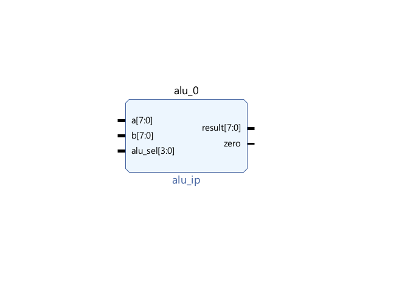
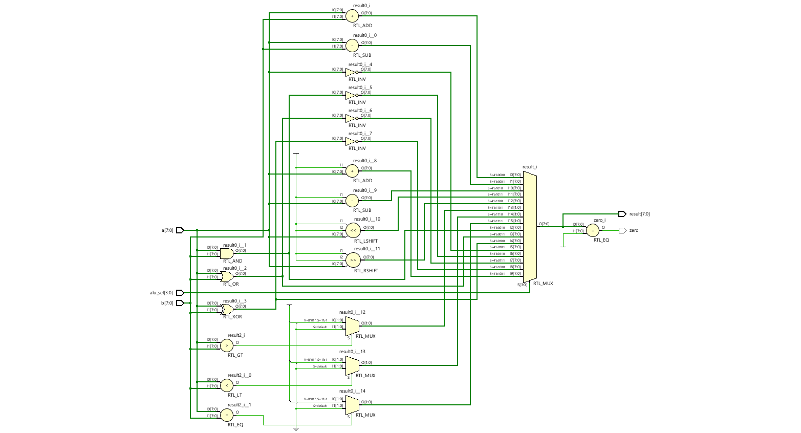
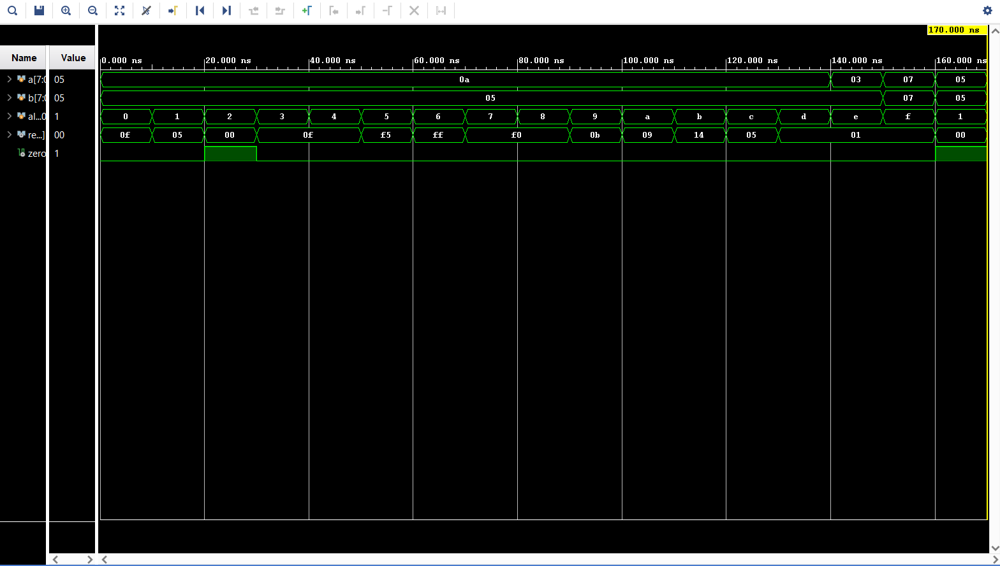

# 8-bit ALU Design using Verilog

## Overview
This project implements an 8-bit Arithmetic Logic Unit (ALU) using Verilog HDL.  
The ALU performs arithmetic, logical, shift, and comparison operations based on a 4-bit control signal (`alu_sel`).  
The design is simulated and verified using Xilinx Vivado.

---
## Features
- 16 operations using 4-bit control input  
- Arithmetic operations: addition, subtraction, increment, decrement  
- Logical operations: AND, OR, XOR, NOT, NAND, NOR, XNOR  
- Shift operations: left and right shift  
- Comparison operations: greater than, less than, equal  
- Zero flag generation  
- Testbench-based verification  
---
## ALU Operations
| alu_sel | Operation     |
|--------|--------------|
| 0000   | ADD          |
| 0001   | SUB          |
| 0010   | AND          |
| 0011   | OR           |
| 0100   | XOR          |
| 0101   | NOT          |
| 0110   | NAND         |
| 0111   | NOR          |
| 1000   | XNOR         |
| 1001   | INCREMENT    |
| 1010   | DECREMENT    |
| 1011   | SHIFT LEFT   |
| 1100   | SHIFT RIGHT  |
| 1101   | GREATER THAN |
| 1110   | LESS THAN    |
| 1111   | EQUAL        |
---
## Block Design

---
## RTL Schematic

---
## Simulation Waveform

---
## Project Files
- 'alu.v' – ALU design  
- 'alu_tb.v' – Testbench  
- Images – Block design, RTL schematic, waveform  
---
## Tools Used
- Verilog HDL  
- Xilinx Vivado  
---
## Future Improvements
- Extend to 32-bit ALU  
- Add carry and overflow flags  
- Parameterized design  
---
## Author
Nitesh
